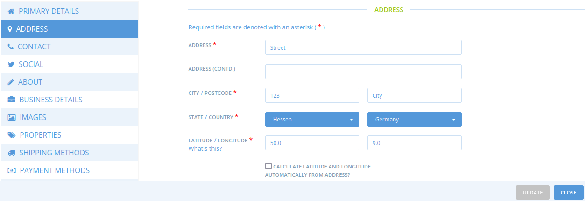

# Delete an enterprise

So far there is no functionality to completely delete an enterprise. A workaround is to change or delete the data, especially change the name, hide the enterprise on the map and replace the email addresses with a standard address.

Here are the details:

* Log in as super admin
* Find the enterprise in question and go to its settings
* In **Primary details** set&#x20;
  * Name: _To Delete_
  * Visible in Search: _Not visible_
  * Permalink: _to\_delete\_xyz_ (with xyz a counting number)

* In **Address** set
  * a standard address (address, city, postcode)
  * change latitude and longitude to standard or random values
  * uncheck "Calculate latitude and longitude automatically from address?"

* Delete all information in&#x20;
  * **Contact**
  * **Social**
  * **About**
  * **Business details**
  * **Images**
  * **Properties**
* In **Shipping methods**
  *   de-activate all shipping methods

      
      If a shipping method was only used by the enterprise in question, the shipping method can be deleted in **Configuration - Payment methods**.
      
* In **Payment methods**
  * disconnect the Stripe account (if connected)
  *   de-activate all payment methods

      
      If a shipping method was only used by the enterprise in question, the shipping method can be deleted in **Configuration - Payment methods**.
      
* In **Tag rules**
  * delete all rules
* In **Shop preferences**
  * delete the "shopfront message"
  * delete the "shopfront closed message"
* In **Enterprises - Permissions**
  * delete any permissions associated with the enterprise
* In **Users** set
  * Manager: hello@ofn.com (one of your own email addresses)
  * Owner: hello@ofn.com (same as manager)
  * Notifications: hello@ofn.com (same as manager)

* Go to **Configuration**
* In **Shipping methods**
  * delete shipping methods which were only used by the enterprise in question
* In **Payment methods**
  * delete payment methods which were only used by the enterprise in question
* In **Enterprise fees**
  * delete enterprise fees which were only used by the enterprise in question
