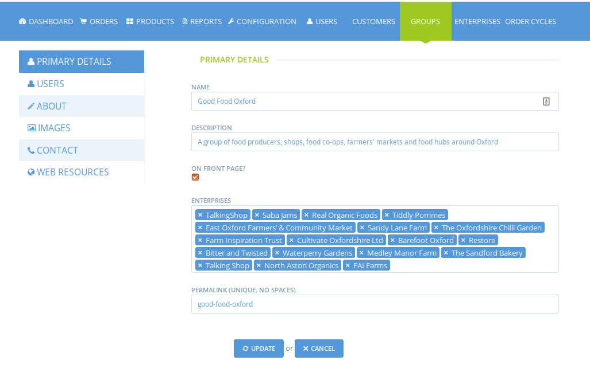
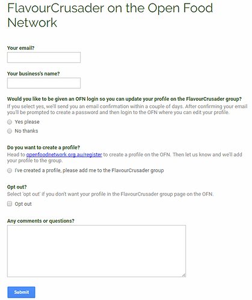
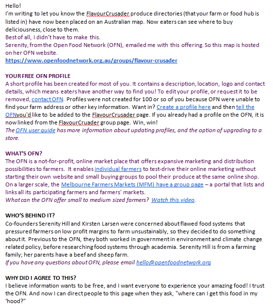
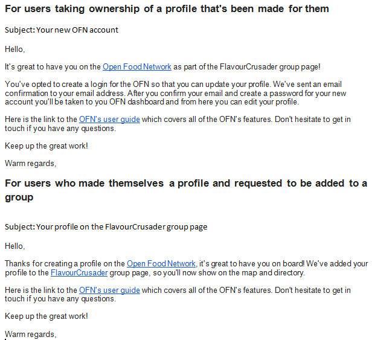

# Groups

What is a group? A Group is a collection of producers and hubs that are co-marketing or working together in some way. The Group page is essentially a mini OFN directory, showing only the Producers and Hubs associated with that Group.

Currently group pages can only be created by SuperAdmin users, at the request of a user.

Once a Group has been created for a user, the nominated User will see a Groups tab in their Enterprise admin interface. Here they can manage the Group, including adding details and photos and adding member enterprises. Below is a screenshot of the groups interface.

## Getting a group onto the OFN

These steps relate to the process of getting existing groups onto the OFN. The Australian experience has been that groups often have their own directory of profiles \(in the form of a regional produce guide, or farmer’s market directory etc\). In these cases, the approach has been to create profiles for the group’s members using information already available and to do a handover of profiles once the group has launched. This is a fast way of getting the group established and driving momentum, rather than asking members to create their own profiles, which can be a slow process.

* A group page should be created and assigned to the email of a representative from the new group. This group should be switched to invisible until the group page is ready to be launched to the members \(step 3\).
* The representative from the group, or an OFN volunteer creates profiles for all of the producers using pre-existing content \(from existing profiles, or facebook pages\). The person setting up the profiles should ‘own’ and ‘manage’ them all and the notificaiton email should also be theirs. The ‘display only’ contact email can be the producer’s actual email \(no notification will be sent\). The reason for not using the producer’s email as the owner or contact for the initial profile, is because this will trigger a confirmation email to be sent to the address, which could be confusing. The profiles should also be invisible, until the group page is launched \(step 3\). As these profiles are created they should be added into the group page.
* When all of the member’s profiles have been created and added into the group page, the profiles and group page can be made visible. Corresponding with this, an email should be sent from the group to the members to let them know that the group is now live on the OFN and that a profile has been created for them. In this email, members should be given the option to take ownership of their profile and also the option to have it removed from the OFN. A google form \(or open source equivalents preferably!\) is a good way to collect a large number of preferences, rather than return emails \(see example below\).

Here is an example launch email…

* Next, based on the responses from members, the group administrator will need to manually go through and transfer ownership for producer who wish to take ownership of their profiles, and delete others. In the case where the member wants to take ownership, the administrator can invite them as a manager. This will trigger an email confirmation to be sent to this email address \(members should be told to expect this email\). 

Here’s email templates to be sent to members, to let them know how to proceed:

When the member confirms their email, they’ll be prompted to create a password, an account will be created for them, and they’ll become a manager of the enterprise, and they’ll be taken to the dashboard to immediately edit their profile. The administrator can then promote this user to be the owner, and delete themselves as owner/manager \(if they no longer wish to have any ownership\).

\*\*Note: In the case that some producers already have profiles on the OFN, you won’t need to create profiles or transfer ownership for them. You’ll just need to let them know that you’ve added their profile to the group this won’t impact on their existing profile or shopfront and won’t cost extra.

