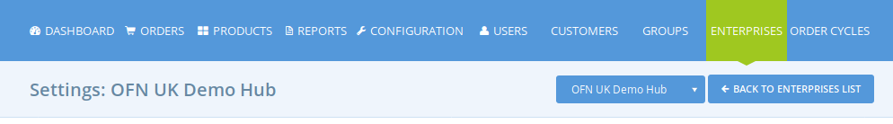
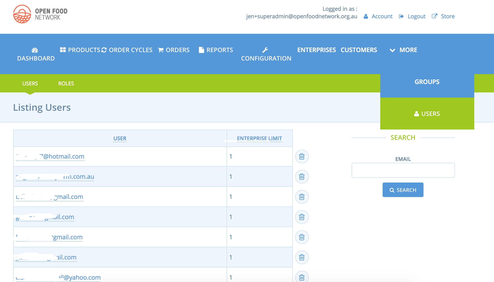
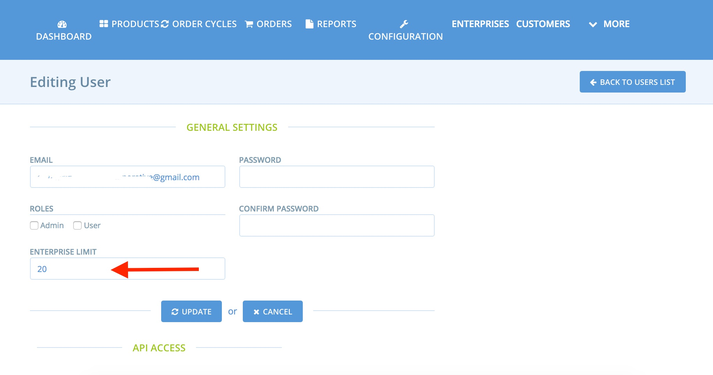

# Managing Users

All users on OFN are defined by a unique login email

There are three types of users

1\) Basic Users \(customers\)

2\) Enterprises Users

3\) Super-Admin Users

## Basic Users \(Customers\)

Anyone can sign up as user from the homepage. This will create a Basic User. Basic users do not see the admin side of OFN, they only see the front facing pages such as the shops and directories.

**Basic User as a Customers**

When a basic user shops in OFN shops their orders will be stored in their account. This lets them keep track of their purchases, save credit card details and save their default contact details. On the other hand if someone shops as a guest \(not logged in\), this information will not be recorded. Customers who create an account \(and become a user\) can also be granted permission to access private shops.

**Basic Users transitioning to Enterprise Users**

While some basic users will only ever interact with OFN as a customer, others will sign-up firstly for a basic account, but will later on become an Enterprise User. They might transition to becoming an Enterprise User by registering for a profile, or if they're added as a manager to an existing enterprise. This user will then become an Enterprise User.

## Enterprise Users

Once a user becomes an owner or a manager of an enterprise, they'll become an enterprise user and gain access to the admin area where they will operate their enterprises.

There are four ways to become an Enterprise Owner

* If joining through the front end sign up process, found at openfoodnetwork.org.au/register \(for the Australian instance, as an example\), the User will automatically become the owner of the enterprise they create.
* If a logged in Enterprise manager or Owner creates an Enterprise from admin, they will be the owner of that Enterprise.
* a User can be granted ‘ownership’ of an enterprise by a SuperAdmin . This can be done on the profile form of the enterprise or the enterprise index page \(see below\). Note, the new owner must be an existing user and manager of the Enterprise.
* the Enterprise Owner can switch ownership to another Manager.

An enterprise can have zero, one or more managers. Managers can’t affect other Managers.

* A user can manage one or more enterprises. The admin interfaces enable them to manage multiple enterprises without logging out and in.
* By default a user can only own five enterprises, however this limit can be raised by a SuperAdmin \(by editing the User\).
* In order to become a manager, the Enterprise Owner must add you as a manager from the enterprise settings.

## Super-Admin Users

Super-Admin Users have the highest level of permission and acts as site administrator. They can view the entire back end of the OFN, manage all enterprises and update instance settings.

* The first super-admin user is set-up when deploying a new instance of OFN.
* There can be multiple SuperAdmins. Creating a SuperAdmin user is covered below. Remember, only trusted colleagues should be granted SuperAdmin status, and they should be aware of which settings they should not touch

### Administering Users as SuperAdmin

SuperAdmin users can create new users, assign users as managers/owners of enterprises and create more SuperAdmin users.

This is done in the Users tab \(only visible to SuperAdmin\)

**Adding a basic users**

You must provide an email address, and create a password. Leave the enterprise limit as 5 and don't select either the Admin or User box.

**Adding a SuperAdmin user**

You must provide an email address, and create a password. Raise the enterprise limit to 100 \(because chances are that this user will need to create multiple profiles\), and select only the 'admin' checkbox.

### Assigning a user to own/manage and enterprise

Go to Enterprises in the horizontal blue menu. Select the enterprise you wish to assign a manager/owner to. Go to the Users tab and add the user as either the owner or manager.

### Increasing how many enterprises a User can mange

When signed is as Super-Admin navigate to the Users tab. You will see the list of all users. 

Use the search field to find the user who has asked to have a higher limit for how many enterprises they can manage \(use their email address to search with\).  When they come up, click their email address to edit the User. 

In the Enterprise Limit field enter the text of how many enterprises they should be able to manage. 

Click the Update button to save changes

