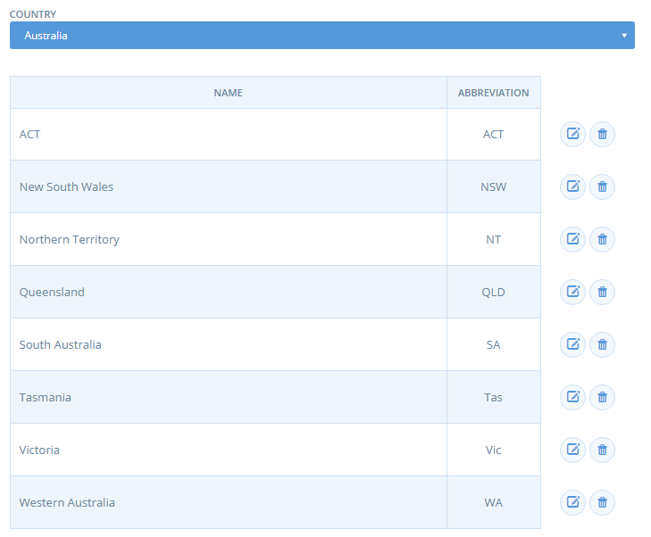

# Countries and States

These pages are where you'll setup relevant states and countries to your instance.

## Countries

This page shows a list of countries. You don't need to play with any settings here.

## States

If you manage states for multiple countries, because your instance is used for various countries (producers from another country, etc.), you need to do that one by one for each organisation. You can also ask a sys admin to do some general import for you.

To do it manually, select your country. Setup states and their abbreviations. You might need to find the equivalent of "states" in your local context. This will be required from users when setting up an enterprise, or for customer when cheking out. So it needs to make sense for them. In France for instance, the local instance has chosen to list the "départements" and not "régions" which would have been the litteral translation, but département was more meaningful for local people.

Choose also carefully the abbreviation as they will display in the registration modal. In France for instance, the local instance has replaced it by the number of the "département" as a textual abbreviation would have made no sense.

The Australian states setup is shown below.

In france :

