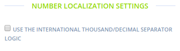
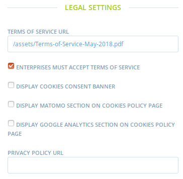
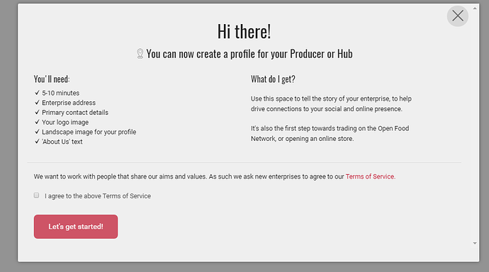
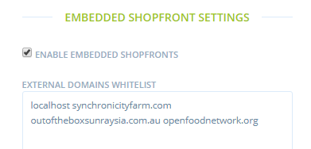

# General Settings

**Site name:** e.g. Open Food Network MyCountry

**Default SEO Title:** we don't use until now...

**Default meta keywords:** e.g. OFN open food

**Default meta description:** e.g. OFN Australia

**Site URL:** e.g. openfoodnetwork.org.au

*Note: You will need to restart the Open Food Netowrk unicorn service for the change of URL to apply (e.g. when an email verification is sent for new sign ups). Login via SSH to your server and run the cmd: `sudo systemctl restart unicorn_openfoodnetwork.service` or alternatively, reboot the server.*

Then scroll down to see further settings. Emulate tick boxes as in image below or vary if obvious for your instance e.g. currency.

## **Security Settings**

Copy the settings pictured below

## **Currency Settings**

**Display currency:** Select if you want for example 'AUD' \(Australian Dollars\) to show in the shop. Deselect if you just want $ to show in the shop.

**Hide cents:** Select if you want to hide the cents component in shops

**Choose currency:** Select the currency of your instance


Please note, if you are using Euro, you must select the 'Number localisation setting' below to avoid price errors. See bug [https://github.com/openfoodfoundation/openfoodnetwork/issues/3057](https://github.com/openfoodfoundation/openfoodnetwork/issues/3057)


**Put currency symbol before or after dollar amount:** Select whether you want $5 or 5$

## Number localisation settings 

Each country has its own convention on how numbers are displayed and use various separators for thousands and decimals.

To make it easier we have implemented the following internationalization logic:

* Whatever the way the number is filled in, it is interpreted, translated and displayed in the default Spree format which is "No thousands separator + a dot \(.\) for decimal separators."
* So that means that if you enter "3,50" as a price that will be translated and displayed "3.50", "3" will become "3.00", "3.500" will become "3500.00" and  "3,500" will become "3500.00" \(we consider that a price can't have 3 decimals and interpret that as , or . being the thousands separator\).
* So this logic is supposed to cover any case of numbers format internationally. If you think your case doesn't fit in while testing please reach out.

## Legal settings

### **Enterprise Terms of Service**

The Terms of Service link can be set here for the instance. See discussion and templates [here](https://community.openfoodnetwork.org/t/instance-based-terms-of-service/734).

The next setting allows an instance to require all new users signing up via the /register wizard to ‘accept terms and conditions’ before they can create a profile. The screenshot below shows what new users will see if this setting is activated.  If activated the user won’t be able to proceed without selecting the “I agree” tickbox. If this setting is not activated all users will be able to create a profile without any mention of Terms of Service. Note regardless of if this setting is on or off, the Terms of Service link is always included in the footer of each instance’s homepage, and in the footer of Welcome to OFN emails sent to new enterprises.

### **Cookies and analytics tracking**

Depending of the location of your instance, the GDPR might require from you that you request a consent from visitors before deposing cookies on their computer. We use the very minimum cookies we really need to make the platform work, so we have collectively written a cookies policy that explains all that, **and you can choose to display the cookie consent banner to request consent from your visitors**. The cookies policy is accessible from the footer at any time.

The only cookie that is not compulsory for the site to work is the navigation tracking cookie that we use analytics,  it gives us data to understand how the visitors use the platform, so that we can improve their experience. 

Currently there are two analytics tool you can use:

* **Matomo.** This is the tool recognized as GDPR friendly. It respect the privacy of users and has been approved by CNIL in France for instance \(which protect data privacy\). If you are in a country within GDPR zone, we highly recommend you to use Matomo for your analytics tracking tool. **If you select the corresponding checkbox, the cookie policy will display the section concerning the cookies used by Matomo, and will enable users to disable these cookies if they want.**
* **Google Analytics.** This tool is much less data friendly, we discourage you to use it, but it's available within the Spree original software we have built on, so you can still use it. **In that case, select the corresponding checkbox to display in the cookies policy the section regarding the cookies used by Google Analytics. If you make that choice, your users won't be able to disable these cookies**.

### **Privacy policy**

If you are within the GDPR zone, you are also required to write and share with your visitors your privacy policy. It includes the cookies policy \(so you can refer to the cookies policy link within your privacy policy document\), but it goes much further. Various EU instances are working on their privacy policy at the moment, we will soon be able to share some examples !

You have then a field here where you can put the link to a PDF version of your privacy policy document. It will display in the footer, near the cookies policy.

## **Embedded Shopfront Settings**

Each instance has the choice of enabling or disabling embedded shopfronts \(enable users to embed their shopfront in an external website, like a wordpress for instance\). You can turn the feature on and off.

If your instance is enabling embedded shopfronts, you’ll need to give each user who wants to embed their shop permission to embed it in their external website. To do this you need to enter their external website URL in the ‘external domain whitelist’. Write the URL without www. or http, as shown below. Separate each by a space. Only once the external URL is on this list will the user be able to embed their shop on that website.

