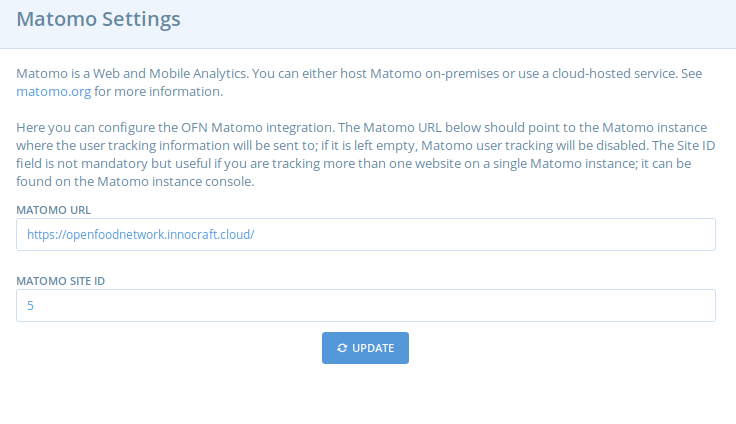

# Matomo settings

[Matomo ](https://matomo.org/)is an analytics tool. OFN has a global Matomo account. Just ask on Slack for someone to give you access to this global account.

As a superadmin, go to "Configuration", then "Matomo settings":  

**Matomo URL:** Fill in the following URL [https://openfoodnetwork.innocraft.cloud/](https://openfoodnetwork.innocraft.cloud/)   


**Do not delete the "/" at the end of the URL otherwise it's not working! The URL is the same for ALL instances**


**Matomo Site ID:**  The image below shows where to find this number in the global Matomo account.

If you don't see your instance in the list, you will have to create a new measurable \(red button\). You will see this message:

Click on "Website". You will then have a form that starts like this:

**If you want to set up quickly, here are the info you need to fill:**

**Name**: Indicate the name of your instance e.g. "OFN UK". Remember that all instances have the same access. Putting a clear name will help everyone to know what site is measured.

**URL**: Fill in the URL of you instance e.g. "[https://www.openfoodfrance.org](https://www.openfoodfrance.org)"

**Only track visits and actions when the action URL starts with one of the above URLs**: leave blank

**Keep Page URL fragments when tracking Page URLs**: leave No \(Default\)

**Excluded IPs**: leave blank

**Excluded parameters**: leave blank

**Excluded User agents**: leave blank

**Site search**: leave default site search enabled

**Ecommerce**: set to "ecommerce enabled" and choose the currency of your instance

**Time zone**: indicate the time zone of your instance

Save. Now you have an ID number! Go back to the configuration page to save the info and you are now ready!

