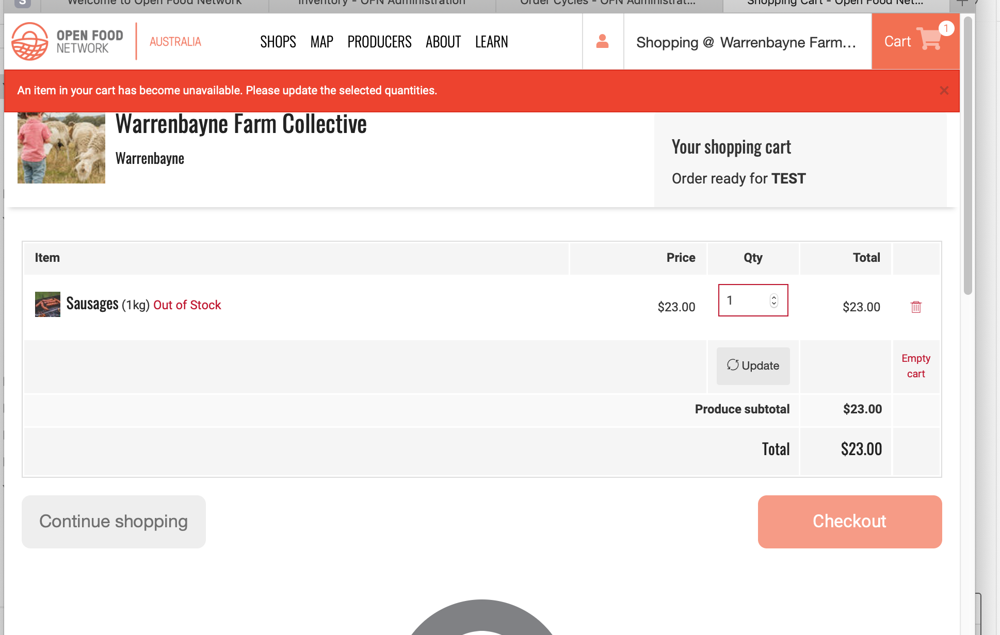
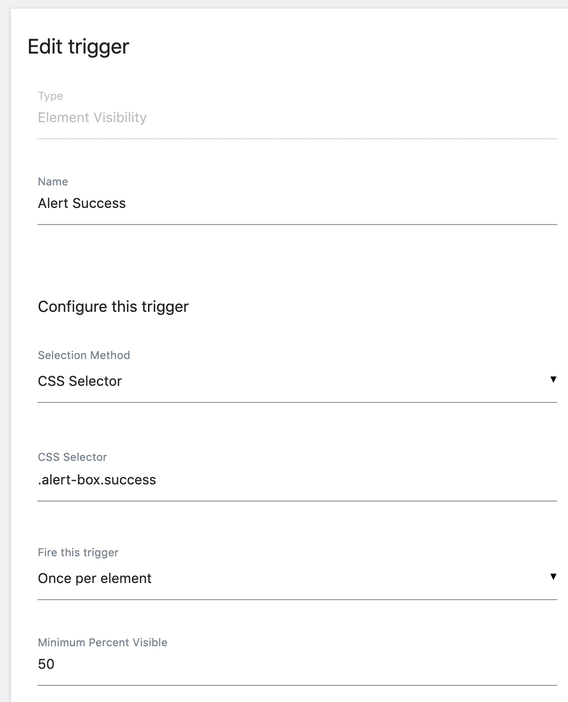
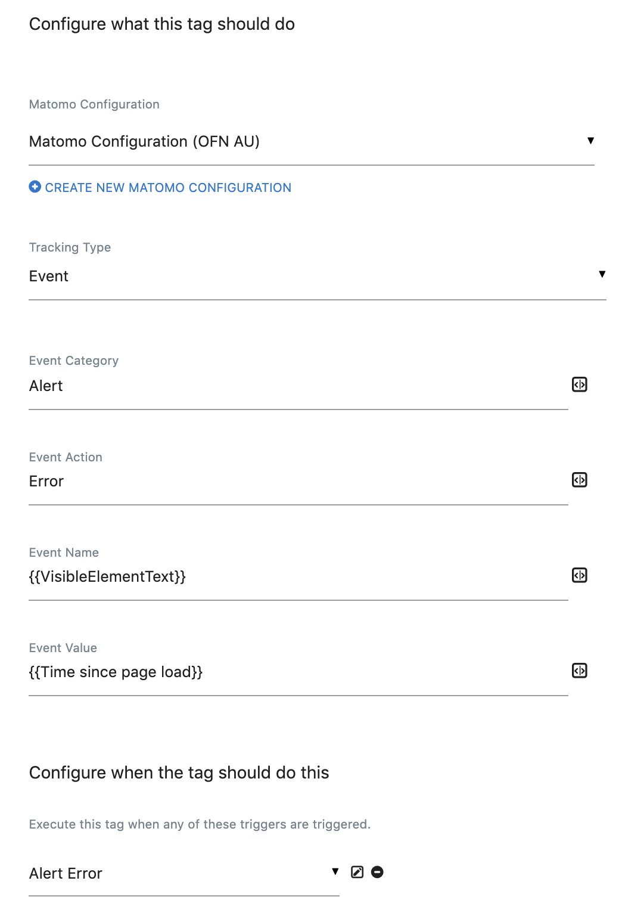
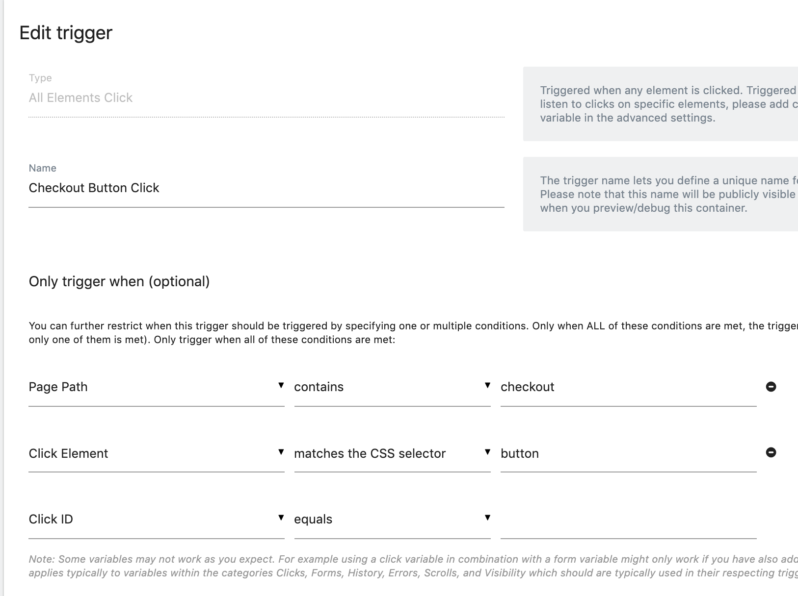
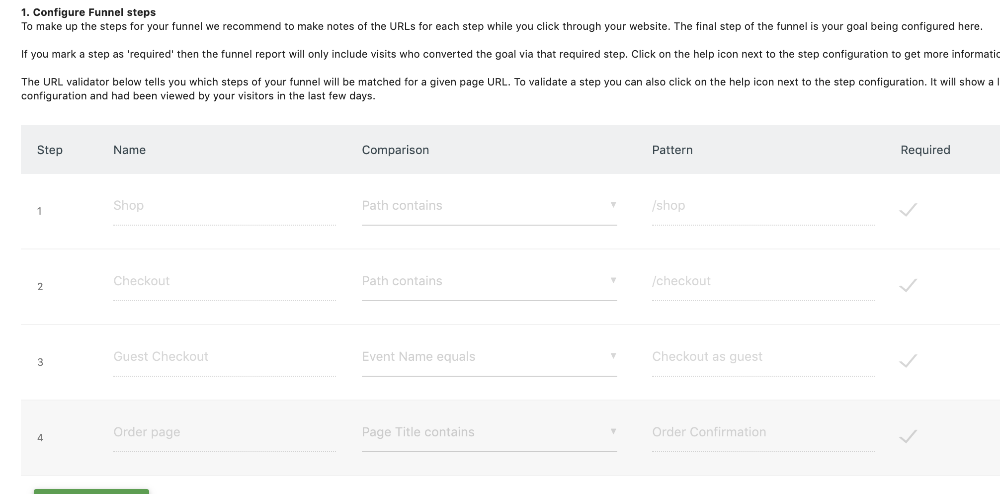
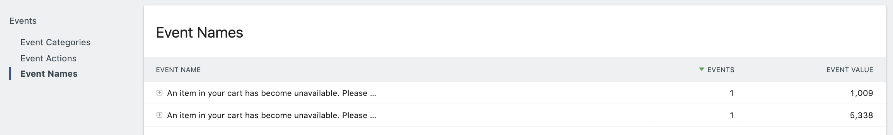
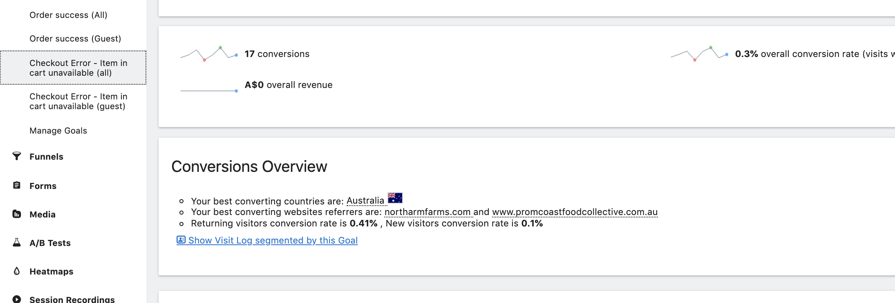
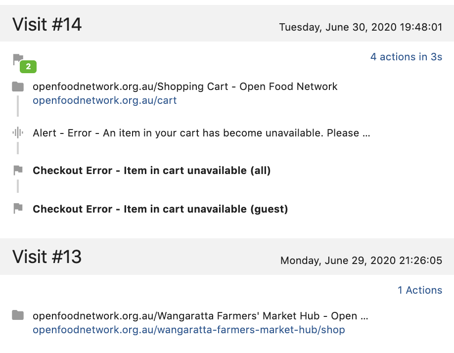

# Using Matomo - an example

## Define the problem

Matomo provides lots of data and interesting graphs and it's very easy to get mesmerised by it all. One way to avoid spending hours of time trawling through data is to limit yourself to understanding a specific problem.

We used Matomo to answer specific questions raised in this [product discussion](https://community.openfoodnetwork.org/t/secure-products-availability-during-checkout-process/1933/13). Some customers were getting errors on checkout, as the items they had in their cart were no longer in stock. The idea we had to fix this was to reserve items for a period of time. However as this would be a big code change, we wanted to make sure it was worth doing.  
  
Our two big questions were:

* How big a problem is this? This will determine the priority of a fix
* How long are people spending in checkout, before getting this error? So we know how long to secure items

We also had anecdotal evidence that this problem was happening a lot for guset checkout users

## What data do we need?

To answer our questions we needed the following data:

* an event telling us that people got the error
* how long people are spending on the checkout page before getting the error
* an event that tells us when people checked out successfully so we know if people recover from the error

Plus we wanted to be able to separate this data by guest shoppers and logged in shoppers.

### Adding events using Matomo Tag Manager

To track these errors we need to create a Tag that is triggered when these red alerts appear on the page. As it happens we also want to do a similar Tag for when the green alert appears on successful checkout.  
   

To track these events, first we need to add 'Trigger's' in Tag Manager that use the 'Element Visibility' type. We use the CSS class of the alert to identify the HTML elements that fire this trigger when they become visible:  
   

Next we add Tags that use these triggers and define the events that we send to Matomo. Select Tags, Add Tag. Here is the detail of the Alert Error tag:

   
This tag is set to send an event to the OFN AU Matomo website \(you may need to _create new matomo configuration_ for your Matomo site\). It is an Event tracking type, and we have named the event fields using granular field names \(granular, consistent, clear naming makes it easier to read reports\). 

For the event name we use the text of the alert. This is not ideal because text is easily changed, and sometimes text is also dynamic - so in reports it will be hard to group events together. An improvement would be to have a data-attribute on alert elements that we can use instead.

For the event value we added the 'Time since page load'. This is because we want to know how long people were on the checkout page before the alert happened \(this didn't work, more on that later!\).

Finally we use the Trigger we just created, 'Alert Error', to tell the Tag Manager when this tag should be executed. 

#### Tags using click events

We also added some more tags that execute when a customer clicks a button on either the Cart or Checkout page. We figured these would be useful for things like the guest checkout button but also in case we want to explore usage on these pages more deeply.

These Tags use triggers that fire when a click happens on a specific page path, on a specific HTML element - button:  
   

#### Publish Tags

Once you have added tags and triggers to Tag Manager, you need to [publish](https://matomo.org/docs/tag-manager/#publish) these so that they start sending events to Matomo. Before publishing you can also test these events by using the [preview](https://matomo.org/docs/tag-manager/#preview-debug) option.

### Using funnels to track user journeys

In Matomo you create [funnels](https://matomo.org/docs/funnels/) that track user journeys. We set up funnels to try and get an understanding of the overall checkout conversion flow, and also to pinpoint which customers go to the checkout page and then get the 'item unavailable' error.  
  
A funnel ends in a goal. For our checkout funnel, we use the order success event that we created with Tag Manager to define the goal.

The funnel steps leading up to the goal are defined with pageviews or events. For example to track the guest checkout process we created a funnel that uses the shop, checkout pageviews as steps, and also the guest checkout event \(a click on a button on the checkout page\).

Funnels are very powerful but can be problematic. This is because people do things differently to what we might expect. We found this with two other funnels we created, that track the process from shopping though to the checkout page, then to receiving the 'item unavailable' error. We found that very few visitors completed this funnel, as our steps were too specific - it didn't cater for things like someone who bookmarks the checkout page and goes straight there, or goes back and forth between the shop and the checkout many times.

### Adding custom dimensions to events and pageviews using the Matomo Tag Manager data layer

One thing that in hindsight would have made our investigation easier, would have been to add extra data to our events, such as shopId, or whether the customer is logged in or not. This can be done by adding values to the [data layer](https://matomo.org/docs/tag-manager/#data-layer) in our code, then adding this data as [variables](https://matomo.org/docs/tag-manager/#user-defined-variables) in Matomo Tag Manager, then sending these to Matomo Analytics as [custom dimensions](https://matomo.org/docs/custom-dimensions/).

## Understanding reports to answer questions

With our events and funnels set up, and after waiting for a few days to collect some data we are ready to view reports and answer our questions.

### Question 1: How big a problem is this? 

This question is fairly easy to answer. We could see from the conversion rate in our checkout funnels that a very high number of customers were successfully completing their order.

We also used the Behavior -&gt; Events report and view events by Event Name. We searched on the specific error text and could see that the error numbers were quite small. 

### Question 2: How long are people spending in checkout, before getting this error?

This question was much harder to answer.  ****I ****mistakenly thought this would be easy - by adding  the 'time on page' value to the event, we'd know how long the person had been in the checkout page. However this error is _actually_ shown on the cart page - where the user is redirected to after submitting the checkout form. Then on the cart page they get this error.

So to answer this we need to find out the time on page for the previous page \(checkout\) to the page that this event is on \(cart\). As I saw it there were two ways to do this.

#### Next step 1: Segment visitor logs

We created a funnel that ends in the error. in this funnel you can click on an icon to view logs segmented by visitors at that point in the funnel. 

If your funnel is too restrictive and you are not seeing a lot of data you can also use the goal to view visit logs segmented by the goal. Our funnel has 8 conversions, but the goal has 17 -- so a bit more data to analyse:

This is good, however the log view is very detailed and so it would be a very long manual process to scan all that info and summarise it enough to answer this question. 

Also visitor logs are broken down into separate sessions, and sometimes you need to dive deeper into the visitor profile to look at earlier logs to understand what this user did. For example this person seems to have loaded up their cart with items from a shop on Monday, then left a browser tab open and tried to load their cart on Tuesday, and got the 'item out of stock' error:

So this approach would work, it is just going to take time to sift through all the data. This is the approach we have decided to take. However in some cases it may be better to use an alternative data analysis approach...

#### Next step 2: Use the Matomo API

The second option was to use the Matomo API to pull the raw data and transform it in code to show the time on page for checkout when these errors are encountered in the cart. This worked \(basic scripts are here\), however it was time consuming \(a few hours\) and there is a limit of 1000 results per request so this needs more work to essentially stream Matomo data to another source so I can analyse a big enough dataset.  
  
For this scenario, as we only have around 20 visitor logs to analyse we opted fro the first approach. However it may be a good idea in future to extract data from Matomo and use a tool like Metabase for doing big data analysis on some product problems.

#### Final learnings

What was interesting from both of these approaches was that we can see from raw logs that the predictable pattern we think is occurring, and that we tried to capture in the funnel, is often even rarely the case. Instead of customers doing the predictable:

> shop -&gt; checkout -&gt; submit -&gt; redirected to cart -&gt; error

The logs often show a much more haphazard pattern - basically people are unique and beautiful snowflakes and will always ruin our mental models with their dang reality! It's often the case with analytics that there are no simple answers, as people's behaviour is far from simple. However by diving in to data you do get a much better sense of what is really happening and that can only help with making better decisions

