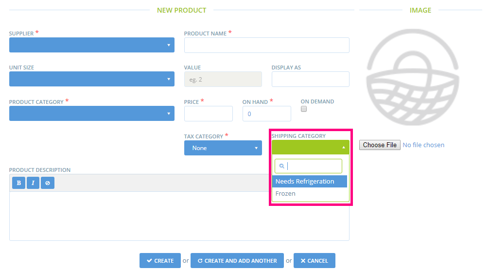

# Shipping Categories

Shipping categories are used to help provide information that might be relevant during shipping.&#x20;

Each shipping method and product can be allocated to a shipping category when creating or editing. This allows broad types of shipping requirements to be attached to specific products and shipping methods.

The primary motivation for the addition of shipping categories is to enable products to be labelled as ‘Temperature Controlled’, meaning they require refrigeration or heat. This can then be used to filter into reports.

Currently Shipping Categories are only used to denote ‘Temperature Controlled’ Items in specific reports. See Current Usage below for details.

**Use Case for Shipping Categories**  \
****A shipping category ‘Requires Refrigeration’ is added in the configuration. A product such as milk, can then have this shipping category. The ‘Temp Controlled’ shipping category also displays in the Delivery Report, so delivery and hub staff know that an order has a refrigerated component, helping them to remember to get this item from the fridge/cool box.

Shipping methods are also linked to shipping categories. A product can only be shipped with a shipping method from the same shipping category, i.e. a product with the 'Temperature controlled' shipping category needs a shipping method with the 'Temperature controlled' shipping category.

**How to Use Shipping Categories**  \
****Configure “shipping categories” giving a relevant name and selecting ‘Temperature Controlled’ if relevant.

When adding a product, add the relevant “Shipping Category”. This will enable the property to filter through to reports where appropriate. This is a compulsory field. It was not compulsory before so lots of products have a Shipping Category named "default" that we used for data migration when we did the Spree upgrade to v.2.

When a user creates a shipping method they have to make sure they select all the shipping categories this method can cover. If a user uses cool boxes for instance in a regular truck, they can select all shipping categories when creating their shipping method.&#x20;


If a product is associated to a shipping category, but the shipping method used by the customer for checkout isn't linked to the same shipping category, the customer won't be able to checkout !


**Current Usage**  \
****Use of the ‘Temperature Controlled’ field on a Shipping Category features in Order Cycle Management - Delivery Report and in the upcoming Packing Reports implemented for the UK team. It can be added to other reports if required.
