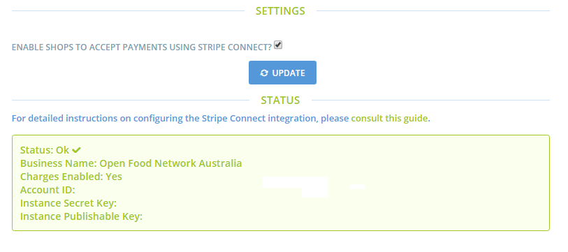

# Stripe Connect

[Stripe ](https://stripe.com/au)is a payment gateway supported by OFN. It allows shops to take payment by credit card.

Your instance can choose whether or not to offer this payment gateway.

The Stripe Connect tab contains a link to [this Stripe setup guide on the Github wiki](https://github.com/openfoodfoundation/openfoodnetwork/wiki/Setting-up-Stripe-on-an-OFN-instance). Just follow the guide to set it up for your instance !

