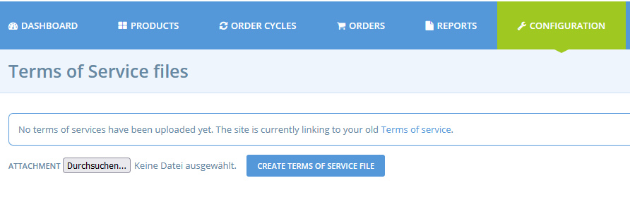

# Terms of Service

On this page you can upload the Terms of Service file for your instance. You can request enterprises and shoppers to accept them before they start doing business on OFN by activating the correspondent settings on the page [General Settings](general-settings.md) in the [Legal Settings](https://app.gitbook.com/@ofn-user-guide/s/ofn-super-admin-guide/\~/drafts/-MhVUOW8IeSo94BS8M9q/ofn-platform-configuration/general-settings#legal-settings) block.
