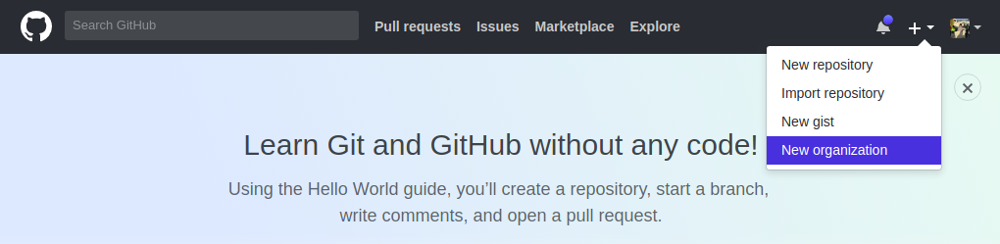
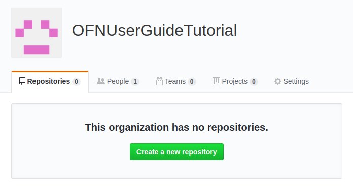
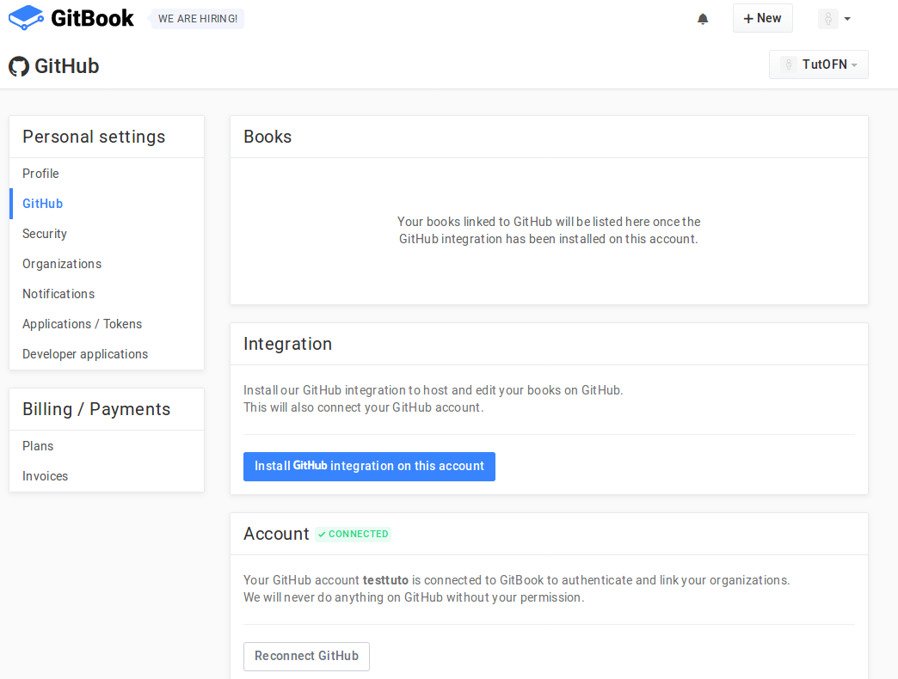
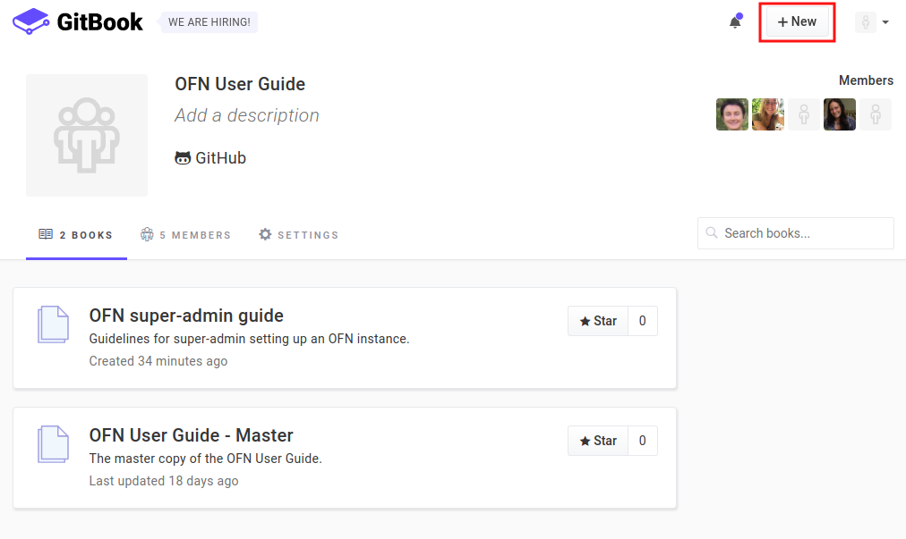
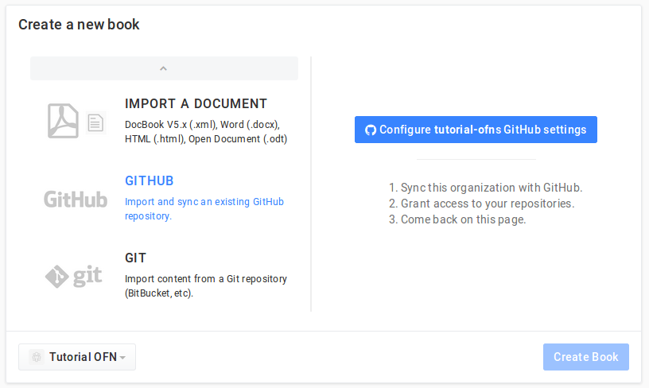
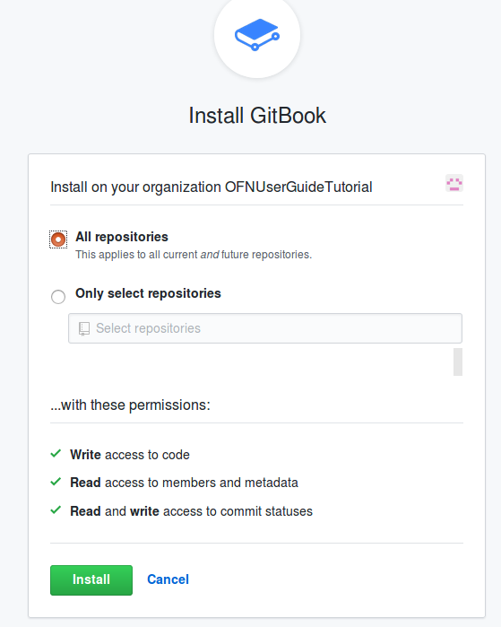

# Set up your user guide

The OFN community use Gitbook to host their user guides. You can choose some other tool if you prefer, but to make your life easier, we propose you a tutorial on how to set up a user guide using Gitbook.

## 1- Create an organization on Gitbook

The first step is to create an account, and then an organization on [https://www.gitbook.com/](https://www.gitbook.com/).  
This organization can host for free 5 members. So you can have up to 5 people able to edit the user guide from [https://www.gitbook.com/](https://www.gitbook.com/) which has a pretty user friendly interface.  
If you want to enable more people to contribute in the user guide, you will need to synchronize with Github, and invite people in the associated Github repository. The interface there is a bit less user friendly, but it does the job ;-\)  
Also you will have to create that Github synchronization if you want to be able to copy the content of the original OFN user guide to adapt it.

## 2- Create a book synchronized with Github

### a- Create a Github repository

Go on 

[https://github.com/](https://github.com/)

 and create yourself an account if you don't have one yet.Then click on "New organization"

Create your organization. Choose the free plan. Your repositories will be public, but that's the beauty of open source isn't it?

If you want to invite other members to that Github organization you can add them already, but you can also do that later.

Then you are invited to create a repository. Do it!

Give it a name and a description, and select "add:gitignore: Gitbook"

### B- Create the connexion between Gitbook and Github

From Gitbook go on your personal account setting and click on "Github", "install github integration on this account"

You will see this:

You need to "Grant" access to the organization where is the repository you want to connect with your Gitbook.

### C- Create a Gitbook and synchronize it automatically with Github

On Gitbook, from your organization page, click on "new"

Then select "GITHUB" and click on "Configure Github settings"

Make sure it's your organization which is selected on the bottom left corner.

Select your repository. 

The integration with your Gitbook organization is done, well done!

Now from Gitbook organization page click on "create a book from github"

Give it a title and description, and choose the repository that you create for that purpose :-

\)

You just have to wait a bit for the synchronization to happen properly.

## 3- Duplicate content from another OFN user guide

If you need now you can easily import the original content from an OFN user guide if you want to easily translate or update the content then.

For that open in Github the original OFN user guide repository, for instance 

[https://github.com/OFNUserGuide/OFN-User-Guide---Master](https://github.com/OFNUserGuide/OFN-User-Guide---Master)

. Click on

And "download ZIP". You will get all the files on your computer, you can extract them from zip folder.

Then on your own user guide repo you can just "upload files".  
One trick to know: if you want to create folders into your repository to organize the files as they are in the original repo, you need to "create new file" and in the name put first the name of the folder and / , this automatically open a new field where you can then create a first file. You can call it empty and leave it empty, and then destroy that file later if you don't need it.

