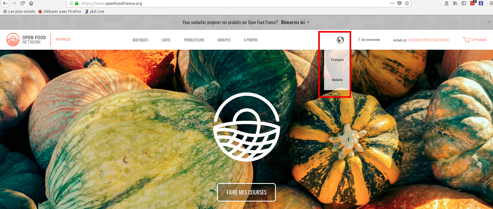
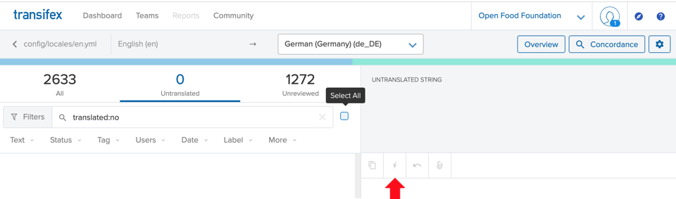
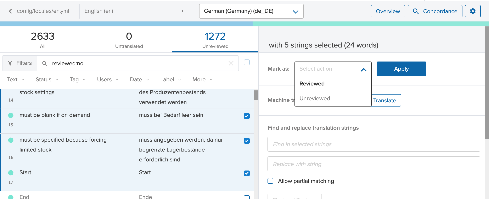

# Translate in your own language

## How we organize translations in OFN

Before you can start translating the OFN, you need to be added to [Transifex](https://www.transifex.com/open-food-foundation/open-food-network/) which is the tool we use to do distributed translation work. [Join our Slack](https://openfoodnetwork.org/slack-invite) and ask there to be added as a translator :-) There is a separate translation file per language AND per territory, for instance there is French-France and French-Canada. This is not only because languages gave variants locally, but also because some of the things translated concerns directly business related information, like business model, and you won't just translate but also update information to your local business model.

It's important to understand how Transifex works: whenever a new feature or line of text is added to OFN, it will create a new "entry" in Transifex that as a language translator you will have to translate. When you have translated to 100% your language localization file is "pushed" to the master OFN code so when you upgrade the code in your local server, you will have the new translation. If you don't translate to 100% developers need to manually "pull" your translation to include them in the code.

So the good practice we recommend is : when a new release is about to be made, developers will ask translators to go into Transifex and translate everything, so that when the release happen things have been translated.

### Some strings that you need to be careful about

* For the key **"language_name"** be careful, the source string is "English" but you have to translate to your own language name, like "Deutch", "Français", "Italiano", etc. This string displays in the dropdown multilingual menu on all OFN pages

* For the key** "menu\_"** those keys represent the menu titles and redirection pages when you clic on this menu. For some menu they will redirect to internal pages, like "shops", so the link will be "/shops". But others like "about" will redirect to external pages, like a wordpress website, so in that case you can put your url in the adequate translation entry.

## Single language translations

If your OFN instance only offers one language for visitors, then you don't have to activate multilingual on your instance. You just have to translate and the developers maintaining your instance will need to make sure they use the good localization file when deploying. Everything is explained in the OFN wiki [here](https://github.com/openfoodfoundation/ofn-install/wiki/Configuration#add-group_vars).

## Multi-lingual instance

Multi-lingual on your instance has to be activated by a developer (explained in the OFN wiki [here](https://github.com/openfoodfoundation/ofn-install/wiki/Configuration#multilingual)).

For now only the interface navigation is multilingual. Data are not, so some information can only be in one language for now :

* Product categories
* Tax categories
* Product properties
* Shipping categories
* Product name and description
* etc.

We hope to be able to move forward quickly on making those multilingual !

## Using Auto/Machine-Translate

You can do a first cut of all your translations very quickly using google's machine translation engine. Once this is done, you can spend your time going through and 'Reviewing' to revise and correct rather than doing everything from scratch.

To do the machine translation, go to 'Untranslated' Tab. In this case there are none untranslated, but when there are you can just 'select all'. You then click on the small 'lightening' button and the magic happens.

## Review Translations 

Once you have either manually or automatically done the first round of translations, they move into the Unreviewed panel. Strings that are in here ARE included in the live language file, but they are kept separately from the 'double-checked' translations. NB. If you use the machine translation above, all newly translated strings are in the Unreviewed panel

You can then open the Unreviewed panel and commence checking / correcting strings. The quickest way is probably to select multiple strings that you are happy with and then apply 'Reviewed' to them at the same time (see below). You can then work through correcting the remaining ones.

